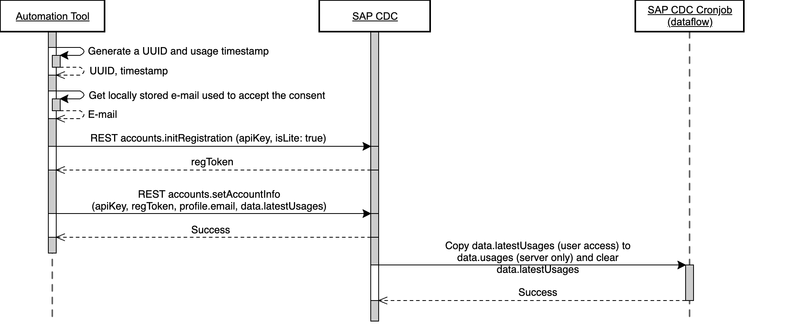

[](https://api.reuse.software/info/github.com/SAP/automated-usage-tracking-tool)

# Automated Usage Tracking Tool

## About this project

The Automated Usage Tracking Tool is designed to help developers track user interactions within their JavaScript and TypeScript applications using [SAP Customer Data Cloud](https://help.sap.com/docs/SAP_CUSTOMER_DATA_CLOUD).

By integrating this tool, you can gather insights into how users interact with various features of your application, which can be invaluable for improving user experience and making data-driven decisions.

<a href="docs/screenshots/screenshot-web-question-active.png"></a>
<a href="docs/screenshots/screenshot-cli-question.png"></a>
<a href="docs/screenshots/screenshot-cdc-list-accounts.png"></a>

### Key features

- **Consent Management**: The tool provides built-in methods to request user consent for tracking, ensuring compliance with privacy regulations.
- **Feature Usage Tracking**: Easily track how often specific features of your application are used.
- **Customizable Storage**: Optionally specify a custom storage name for tracking data.
- **Web and CLI Support**: The tool supports both web and command-line interface (CLI) applications.
- **Theme Support**: For web applications, you can apply the [`sap_horizon`](#themes) theme to the consent dialog for a consistent look and feel.

## Requirements and Setup

- **Node.js**: Ensure you are using Node.js version 19 or higher.

This tool is ready to use by JavaScript/Typescript client applications after importing and installing it from NPM.

### Create a new project

```sh
npm init
```

### Install package

Install @sap_oss/automated-usage-tracking-tool as a dependency of the new project

```sh
npm install @sap_oss/automated-usage-tracking-tool
```

### Import the package

Import the default artifact

```js
import TrackingTool from '@sap_oss/automated-usage-tracking-tool'
```

### Initialize the tracker

```js
const trackingTool = new TrackingTool({
  apiKey: [apiKey],
  dataCenter: [dataCenter],
  storageName: [storageName], // Optional
})
```

### Request Consent

Ask for consent confirmation or ask the consent question to the user.

**Note:** If the consent was already granted, the consent dialog will not be shown (no extra validations needed).

```js
await trackingTool.requestConsentConfirmation() // Possible Answer: Yes (or exit app)
// OR
await trackingTool.requestConsentQuestion() // Possible Answers: Yes or No
```

### Track Usages

Track usages of your application features.

**Note**: If the consent was not granted, the usage will not be tracked (no extra validations needed).

```js
trackingTool.trackUsage({
  toolName: [toolName],
  featureName: [featureName],
})
```

### Themes

For the web version, there is the option to import the sap_horizon theme to be applied to the consent dialog

```js
import '@sap_oss/automated-usage-tracking-tool/theme/sap_horizon.css'
```

### Types

Types are available for Typescript client applications.

```js
import { TrackerArguments, TrackUsageArguments, ConsentArguments } from '@sap_oss/automated-usage-tracking-tool'
```

### Extra: Check If The Consent Was Already Granted

**This method is not necessary for the implementation** (as this is performed behind the scenes), but it can be used to check if the consent was already granted if you want to use that information in your application.

```js
trackingTool.isConsentGranted()
```

## Usage Examples

In the `/examples` folder there are available examples of Javascript and Typescript Web and CLI client apps using the tool.

### JavaScript CLI Client

This example demonstrates the integration with a JavaScript CLI client application. See [examples/javascript-cli-client/README.md](examples/javascript-cli-client/README.md) for more details.

### JavaScript Web Client

This example demonstrates the integration with a JavaScript web client application. See [examples/javascript-web-client/README.md](examples/javascript-web-client/README.md) for more details.

### TypeScript CLI Client

This example demonstrates the integration with a TypeScript CLI client application. See [examples/typescript-cli-client/README.md](examples/typescript-cli-client/README.md) for more details.

### TypeScript Web Client (Angular)

This example demonstrates the integration with a TypeScript web client application. See [examples/typescript-web-client/README.md](examples/typescript-web-client/README.md) for more details.

## Architecture

### Block Diagram

<a href="docs/architecture/general_block_diagram.png"></a>

### Sequence Diagram - Consent Request

<a href="docs/architecture/get_and_save_user_consent.png"></a>

### Sequence Diagram - Track Usage

<a href="docs/architecture/save_new_usage.png"></a>

## Support, Feedback, Contributing

This project is open to feature requests/suggestions, bug reports etc. via [GitHub issues](https://github.com/SAP/automated-usage-tracking-tool/issues). Contribution and feedback are encouraged and always welcome. For more information about how to contribute, the project structure, as well as additional contribution information, see our [Contribution Guidelines](CONTRIBUTING.md).

## Security / Disclosure

If you find any bug that may be a security problem, please follow our instructions at [in our security policy](https://github.com/SAP/automated-usage-tracking-tool/security/policy) on how to report it. Please do not create GitHub issues for security-related doubts or problems.

## Code of Conduct

We as members, contributors, and leaders pledge to make participation in our community a harassment-free experience for everyone. By participating in this project, you agree to abide by its [Code of Conduct](https://github.com/SAP/.github/blob/main/CODE_OF_CONDUCT.md) at all times.

## Licensing

Copyright 2024 SAP SE or an SAP affiliate company and automated-usage-tracking-tool contributors. Please see our [LICENSE](LICENSE) for copyright and license information. Detailed information including third-party components and their licensing/copyright information is available [via the REUSE tool](https://api.reuse.software/info/github.com/SAP/automated-usage-tracking-tool).
